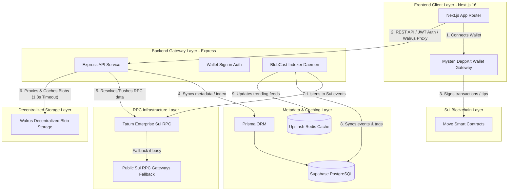
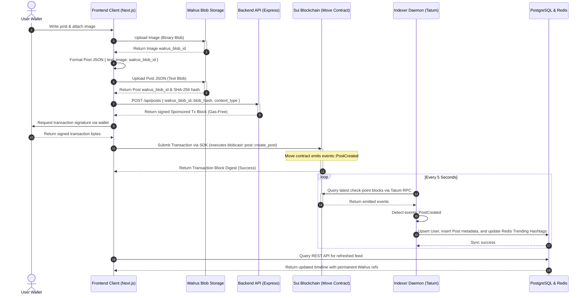
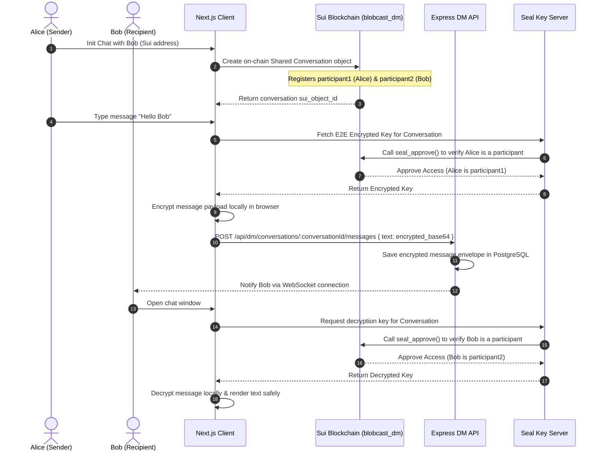
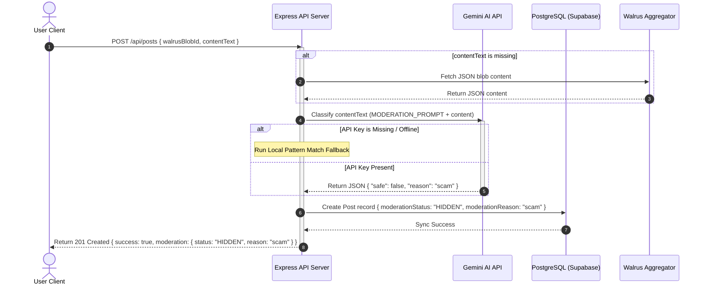

# 🌊 BlobCast — System Architecture & Diagrams

This document provides a comprehensive deep-dive into the architectural design, layer interaction, and data pipelines of the **BlobCast** decentralized social publishing protocol. It details how the client, backend, off-chain caching, Tatum RPC network, and Walrus permanent storage layers interact seamlessly.

---

## 1. High-Level Architectural Layering

BlobCast uses a **hybrid Web3 architecture** designed to combine the absolute trust and permanent censorship resistance of decentralized protocols with the high performance and low latency expected of modern social networks. 

---

## 2. Dynamic Post & Content Lifecycle

To keep on-chain gas costs low while preserving 100% verifiability, BlobCast separates **content storage** from **ownership verification**:
1. Heavy blobs (JSON posts, images, videos) are committed permanently to **Walrus**.
2. Minimal cryptographic proof (Walrus Blob ID + SHA-256 hash) is registered on the **Sui Blockchain**.
3. Real-time events are indexed into high-performance databases (**PostgreSQL & Redis**).

Below is the step-by-step transaction flow when a user creates a new post with media:

---

## 3. End-to-End Encrypted Messaging (DM) Workflow

Direct messages on BlobCast are encrypted peer-to-peer. The shared conversation state is registered on-chain via `blobcast_dm.move`, while the encrypted message envelopes are indexed for fast UI retrieval. Decryption keys are managed verifiably via Seal Key Servers utilizing the Move `seal_approve` policy gate.

---

## 4. Key Architectural Resiliency Features

### A. High-Availability Tatum RPC Gateways
The Express API utilizes Tatum's high-speed Sui nodes for reading checkpoint data and indexing events. However, to guarantee 100% platform uptime:
- **Resilient Fallback**: If Tatum nodes exceed rate limits or face network congestion, the server automatically routes query requests to public Sui RPC gateways.
- **Simulated Daemon Stream**: If all connection gates are unresponsive, the system triggers the built-in *Simulated Indexer Engine*. This engine simulates live Move transaction telemetry, writing verified posts, profile checkmarks, likes, and tips into PostgreSQL and Redis so that visual UI dashboards and trending hashtag widgets remain fully operational and testable during offline hackathon demonstrations.

### B. Indexer Auto-FastForward Guard
To avoid infinite looping, excessive database writes, and memory leaks when the indexer is spun up after a long period of inactivity:
- If the current local block tracker lags behind the live Sui block tip by more than **50 checkpoints**, the indexer triggers the *Auto-FastForward Guard*.
- It logs a sequence skip message and jumps the pointer directly to the current live tip block sequence, ensuring immediate real-time event updates without system freeze.

### C. Server-Side Walrus Aggregator Proxy & Caching
To completely bypass browser cross-domain network connection limits (maximum 6 concurrent connections per host) and prevent page-loading freezes caused by slow, rate-limited public Walrus aggregators, BlobCast routes all blob downloads through the Express API backend proxy at `/api/walrus/blobs/:blobId`.
- **Database Caching**: If the requested blob is in the `SimulatedBlob` PostgreSQL database table, the server resolves it in sub-milliseconds (Cache Hit).
- **Aggregator Proxy with Caching**: If not found (Cache Miss), the backend server actively queries the decentralized Walrus testnet aggregator (`https://aggregator.walrus-testnet.walrus.space`) with a strict **1.8-second timeout**, caches the returned content in PostgreSQL, and serves it to the browser.
- **Offline Resilience**: If the aggregator fails or is offline, the backend serves a clean, structural mockup JSON fallback directly, ensuring 100% feed uptime.

---

## 5. Gemini AI Content Moderation & Filtering

To maintain compliance with platform safety standards without violating the Web3 principle of absolute user ownership, BlobCast utilizes a **hybrid content filtering architecture**:
1. **Immutable Storage**: Heavy media and raw JSON post objects are committed permanently to **Walrus Storage**. Because of Walrus's decentralized nature, once a blob is written, it cannot be edited or deleted by anyone.
2. **AI Moderation Pipeline**: When a new post or comment is registered in the database, the backend Express server intercepts the raw text (retrieved either from the request body or via the Walrus Aggregator Proxy) and executes an asynchronous classification query against the **Gemini API** using `gemini-2.0-flash`.
3. **Soft-Filtering (UI masking)**: If Gemini flags the content as containing spam, scams, hate speech, explicit material, phishing, or malware:
   - The registry is saved in the Supabase PostgreSQL database with `moderationStatus` set to `HIDDEN` and `moderationReason` containing the categorized safety violation.
   - Database read queries utilize the predefined Prisma filters [visiblePostWhere](file:///Users/wahyutricahya/Hackathon/BlobCast/server/src/lib/moderation/constants.ts#L13) and [visibleCommentWhere](file:///Users/wahyutricahya/Hackathon/BlobCast/server/src/lib/moderation/constants.ts#L21) to filter out flagged posts/comments from timeline feeds.
   - The content is hidden at the presentation layer, but the decentralized Walrus blob ID remains unchanged and completely verifiable on-chain.

### Content Moderation Lifecycle Workflow

### Local Developer Testing & Fallback

To support local offline development and bypass rate limits, the moderation engine includes an active **local regex pattern matcher** in [geminiModeration.ts](file:///Users/wahyutricahya/Hackathon/BlobCast/server/src/lib/moderation/geminiModeration.ts). Developers can use specific trigger tags in their posts or comments to test moderation states instantly:
- `[spam]` or `buy cheap followers` -> Flags as **spam**
- `[scam]` or `send 1 sui get 2 sui` -> Flags as **scam**
- `[hate]` or `hate group` -> Flags as **hate**
- `[explicit]` or `nude pics` -> Flags as **explicit**
- `[phishing]` or `enter your seed phrase` -> Flags as **phishing**
- `[malware]` or `run this executable` -> Flags as **malware**

