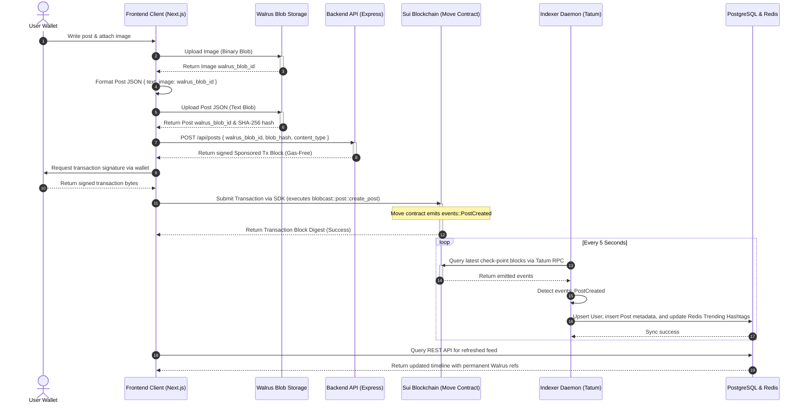
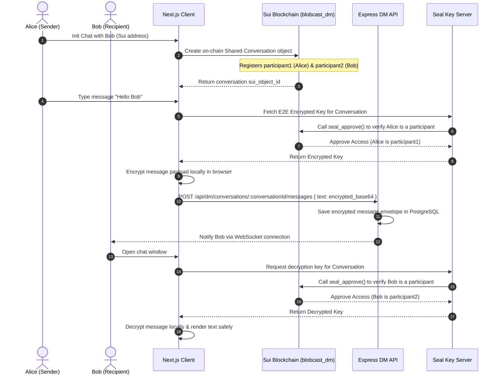

# 🌊 BlobCast — System Architecture & Diagrams

This document provides a comprehensive deep-dive into the architectural design, layer interaction, and data pipelines of the **BlobCast** decentralized social publishing protocol. It details how the client, backend, off-chain caching, Tatum RPC network, and Walrus permanent storage layers interact seamlessly.

---

## 1. High-Level Architectural Layering

BlobCast uses a **hybrid Web3 architecture** designed to combine the absolute trust and permanent censorship resistance of decentralized protocols with the high performance and low latency expected of modern social networks. 

```mermaid
graph TB
    subgraph Client Layer [Frontend Client Layer - Next.js 16]
        ClientApp[Next.js App Router]
        DappKit[@mysten/dapp-kit Wallet Gateway]
    end

    subgraph API Layer [Backend Gateway Layer - Express]
        API[Express API Service]
        Auth[Wallet Sign-in Auth]
        Indexer[BlobCast Indexer Daemon]
    end

    subgraph Storage Layer [Decentralized Storage Layer]
        Walrus[Walrus Decentralized Blob Storage]
        WalrusSim[Local Simulated Blob DB Fallback]
    end

    subgraph RPC Layer [RPC Infrastructure Layer]
        Tatum[Tatum Enterprise Sui RPC]
        PublicSui[Public Sui RPC Gateways Fallback]
    end

    subgraph Chain Layer [Sui Blockchain Layer]
        Move[Move Smart Contracts]
    end

    subgraph Cache Layer [Metadata & Caching Layer]
        Prisma[Prisma ORM]
        DB[(Supabase PostgreSQL)]
        Redis[(Upstash Redis Cache)]
    end

    %% Client Interactions
    ClientApp -->|1. Connects Wallet| DappKit
    ClientApp -->|2. REST API / JWT Auth| API
    ClientApp -->|3. Uploads heavy media| Walrus
    DappKit -->|4. Signs transactions / tips| Move

    %% Backend Interactions
    API -->|5. Syncs metadata / index| Prisma
    API -->|6. Resolves/Pushes RPC data| Tatum
    API -->|7. Local developer fallback| WalrusSim
    Indexer -->|8. Listens to Sui events| Tatum
    Indexer -->|9. Syncs events & tags| DB
    Indexer -->|10. Updates trending feeds| Redis

    %% Failover Fallbacks
    Tatum -.->|Fallback if busy| PublicSui
    Walrus -.->|Fallback if offline| WalrusSim
    Prisma --> DB
```

---

## 2. Dynamic Post & Content Lifecycle

To keep on-chain gas costs low while preserving 100% verifiability, BlobCast separates **content storage** from **ownership verification**:
1. Heavy blobs (JSON posts, images, videos) are committed permanently to **Walrus**.
2. Minimal cryptographic proof (Walrus Blob ID + SHA-256 hash) is registered on the **Sui Blockchain**.
3. Real-time events are indexed into high-performance databases (**PostgreSQL & Redis**).

Below is the step-by-step transaction flow when a user creates a new post with media:



---

## 3. End-to-End Encrypted Messaging (DM) Workflow

Direct messages on BlobCast are encrypted peer-to-peer. The shared conversation state is registered on-chain via `blobcast_dm.move`, while the encrypted message envelopes are indexed for fast UI retrieval. Decryption keys are managed verifiably via Seal Key Servers utilizing the Move `seal_approve` policy gate.



---

## 4. Key Architectural Resiliency Features

### A. High-Availability Tatum RPC Gateways
The Express API utilizes Tatum's high-speed Sui nodes for reading checkpoint data and indexing events. However, to guarantee 100% platform uptime:
- **Resilient Fallback**: If Tatum nodes exceed rate limits or face network congestion, the server automatically routes query requests to public Sui RPC gateways.
- **Simulated Daemon Stream**: If all connection gates are unresponsive, the system triggers the built-in *Simulated Indexer Engine*. This engine simulates live Move transaction telemetry, writing verified posts, profile checkmarks, likes, and tips into PostgreSQL and Redis so that visual UI dashboards and trending hashtag widgets remain fully operational and testable during offline hackathon demonstrations.

### B. Indexer Auto-FastForward Guard
To avoid infinite looping, excessive database writes, and memory leaks when the indexer is spun up after a long period of inactivity:
- If the current local block tracker lags behind the live Sui block tip by more than **50 checkpoints**, the indexer triggers the *Auto-FastForward Guard*.
- It logs a sequence skip message and jumps the pointer directly to the current live tip block sequence, ensuring immediate real-time event updates without system freeze.

### C. Walrus Storage Simulation Fallback
The client-side Walrus SDK contains a mock/simulated fallback gateway. If an active Walrus publishing node cannot be resolved on local development machines, the client falls back to the server's simulated endpoint `/api/walrus/blobs`. This writes the binary media or serialized JSON posts directly into the PostgreSQL database under the `SimulatedBlob` model and serves it with normal HTTP content-types, simulating full permanent decentralized blob storage operations seamlessly.
