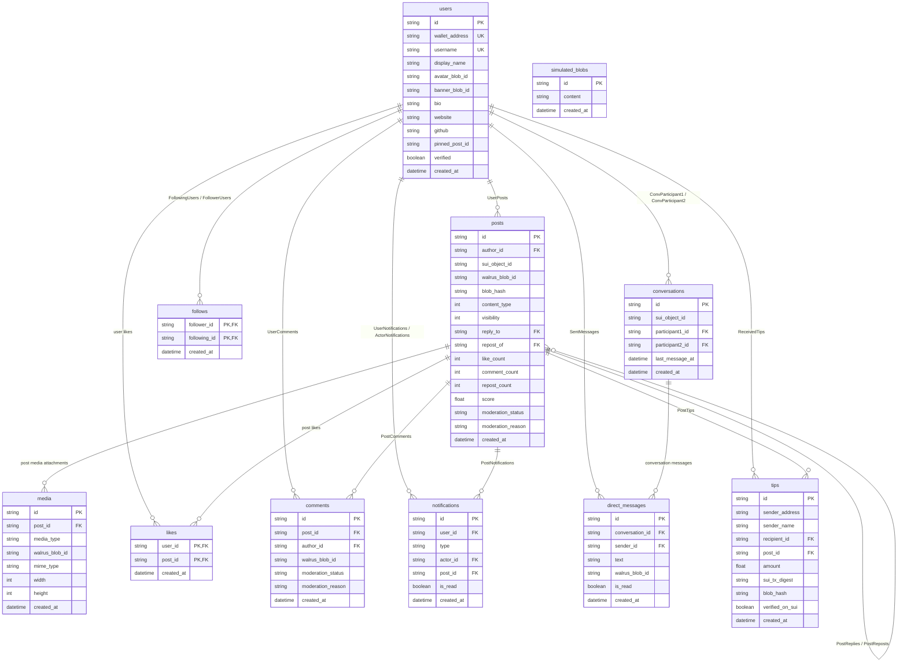

# 🗄️ BlobCast — Database Schema & Caching Design

This document details the relational PostgreSQL database schema managed via **Prisma ORM**, the Entity-Relationship (ER) model of the off-chain indexing layer, and the key-value caching schemas implemented in **Redis** to power the social feed, notifications, and trending engines.

---

## 1. Entity-Relationship (ER) Diagram

The following diagram maps the database entities in our PostgreSQL/Supabase database. Relationships are fully enforced with foreign key constraints, cascade deletions, and index mappings for fast query resolution.

---

## 2. PostgreSQL Tables & Schema Details

### A. User Entity (`users`)
Represents a decentralized creator profile. In keeping with decentralized principles, the primary key `wallet_address` is unique, representing the user's sovereign cryptographic address.
- **Fields**:
  - `id`: `String` (UUID) - Primary Key.
  - `walletAddress`: `String` - Sovereign Sui Wallet Address (Unique).
  - `username`: `String` (Nullable, Unique) - Optional handle.
  - `displayName`: `String` (Nullable) - Visual user name.
  - `avatarBlobId`: `String` (Nullable) - Walrus Blob Reference to profile picture.
  - `bannerBlobId`: `String` (Nullable) - Walrus Blob Reference to profile background banner.
  - `bio`: `String` (Nullable) - Text description.
  - `verified`: `Boolean` - Sui-native profile verification checkmark (defaults to `false`).

### B. Post Entity (`posts`)
Tracks social publications. The content (JSON structure with body text, links, and hashtags) sits permanently on **Walrus**, while the index maintains fast references and telemetry scores.
- **Fields**:
  - `id`: `String` (UUID) - Primary Key.
  - `authorId`: `String` - Foreign Key mapping to `User(id)` (OnDelete: Cascade).
  - `suiObjectId`: `String` (Nullable) - Reference to the Move shared `Post` object ID on-chain.
  - `walrusBlobId`: `String` - Permanent content storage pointer on Walrus (`walrus://...`).
  - `blobHash`: `String` - SHA-256 integrity hash of the original uploaded text blob.
  - `contentType`: `Int` - Enum representing type of post (`0 = text`, `1 = image`, `2 = video`).
  - `likeCount`, `commentCount`, `repostCount`: `Int` - Counter caches updated in real-time.
  - `score`: `Float` - Dynamic trending score used to populate the trending timeline algorithms.
  - `moderationStatus`: `String` (Default: `"VISIBLE"`) - AI Content Moderation flag. High-availability moderation masks flagged text/media in the UI without deleting the immutable Walrus blob.

### C. Media Entity (`media`)
Attaches permanent images or videos stored on Walrus to specific posts.
- **Fields**:
  - `id`: `String` (UUID) - Primary Key.
  - `postId`: `String` - Foreign Key mapping to `Post(id)` (OnDelete: Cascade).
  - `walrusBlobId`: `String` - Decentralized permanent storage ID for the image/video binary.
  - `mediaType`, `mimeType`: `String` - Metadata indicating how the client should render the asset.

### D. Tipping Entity (`tips`)
Logs on-chain SUI tip transactions sent from readers directly to creators.
- **Fields**:
  - `id`: `String` (UUID) - Primary Key.
  - `senderAddress`: `String` - Wallet address of the tipper.
  - `recipientId`: `String` - Foreign Key mapping to `User(id)` who received the tip.
  - `postId`: `String` (Nullable) - Optional reference linking the tip to a specific post (OnDelete: SetNull).
  - `amount`: `Float` - Tip amount in SUI coin decimal values.
  - `suiTxDigest`: `String` (Nullable) - Transaction block hash on Sui, verifying the coin transfer on-chain.

### E. Social Relationship Entities (`follows`, `likes`, `comments`)
- **`follows`**: Represents follower connections on-chain. Uses a compound Primary Key of `[follower_id, following_id]` mapping to `User(id)`.
- **`likes`**: Verifiable signed likes linking users to specific posts. Uses a compound Primary Key of `[user_id, post_id]`.
- **`comments`**: Threaded discussion references. Heavy comment blocks are saved as independent Walrus blobs, with the index containing `postId` and `authorId` associations.

---

## 3. Redis Key-Value Schema & Caching Layer

BlobCast utilizes **Redis** to offload repetitive PostgreSQL query patterns, compile trending hashtags dynamically, and stream live system notification updates over WebSockets.

| Redis Key Pattern | Data Type | Expiration | Purpose |
|-------------------|-----------|------------|---------|
| `trending:tags:{tag_name}` | `String` (Counter) | 24 Hours (86,400s) | Increments the dynamic count of hashtag usages across the system. Powers the **Trending hashtags widget** on the Explore page. |
| `notifications:latest` | `String` (JSON object) | None | Stores the single most recent indexer notification payload (e.g. SUI tips, user profile creation) for real-time visual telemetry logs. |
| `indexer:last_checkpoint` | `String` (Integer) | None | Keeps track of the last processed Sui checkpoint block sequence by the daemon indexer, enabling safe recovery on restart. |
| `cache:feed:global` | `String` (JSON array) | 5 Minutes (300s) | Caches the compiled global timeline query to prevent heavy join queries on PostgreSQL database threads during high traffic. |

---

## 4. Architectural Rationale

1. **Prisma ORM & PostgreSQL (Supabase)**:
   A relational schema is chosen for metadata because querying a pure decentralized social graph directly from a blockchain (or recursively resolving thousands of Walrus blob IDs) is too slow for normal web application interactions (which require $< 100\text{ms}$ responses). PostgreSQL handles all relational constraints, quick search queries, and fast feed rendering, while the blockchain acts as the absolute *truth ledger* and *content signature* verification lock.

2. **Redis Trending Engine**:
   Rather than performing expensive regex searches across PostgreSQL text rows to compute trending tags every time the Explore page is loaded, the indexer parses hashtags from post bodies at the moment they are written. It increments these values in Redis using `cache.incr()`. Setting a **24-hour expiration** on these keys automatically clears stale tags, keeping the trending list accurate and dynamically focused on active topics.
